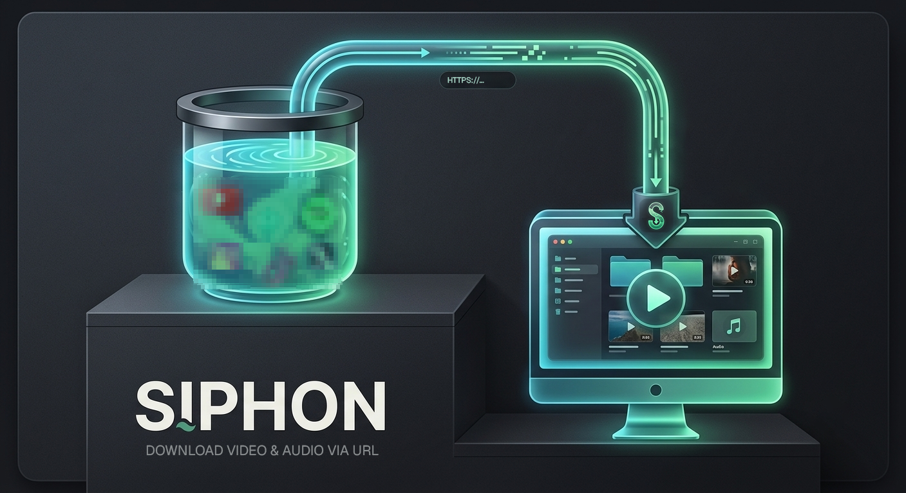
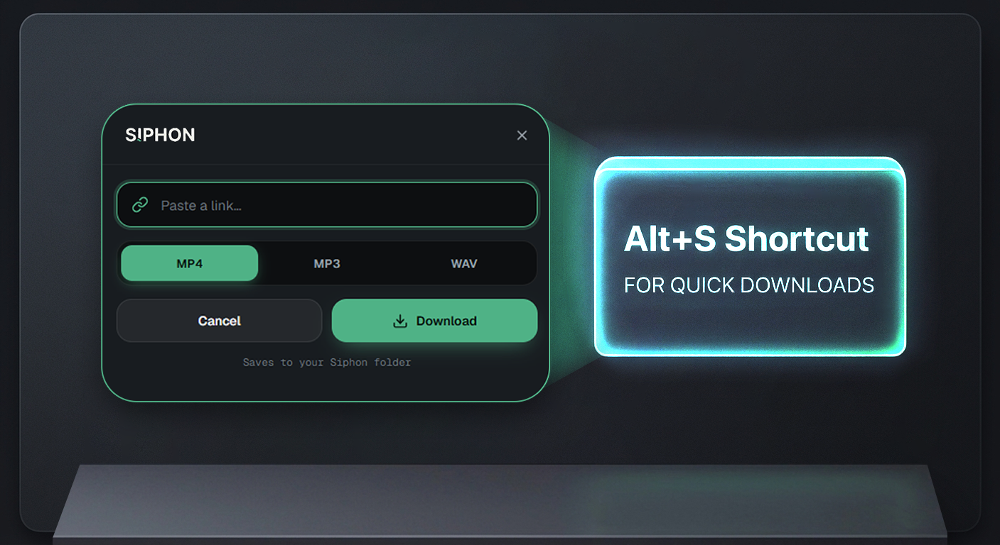

<p align="center">
  
</p>

<h1 align="center">Siphon</h1>

<p align="center">
  A sleek desktop media downloader. Paste a link, pick a format, and Siphon saves it locally as <strong>MP4</strong>, <strong>MP3</strong>, or <strong>WAV</strong>.<br/>
  Built with <a href="https://v2.tauri.app">Tauri v2</a>, Rust, and vanilla JavaScript.
</p>

<p align="center">
  <em>Free &amp; open source · local-first · no accounts · no telemetry</em>
</p>

<p align="center">
  
</p>

---

> **Disclaimer:** Siphon is for **lawful, personal use only** — media you own, created, or
> have permission to download, and for testing against **private platforms you control
> yourself**. The author does not condone or promote unlawful use. See
> [DISCLAIMER.md](DISCLAIMER.md).

## What it is

Siphon is a native rewrite of a small Node/Express downloader, rebuilt as a lightweight,
local-first desktop app with a glassmorphic UI.

- Paste any media URL and export **MP4**, **MP3**, or **WAV**
- **Preview** metadata (title, thumbnail, duration, source) before downloading
- **Direct media** links (`.mp4`, `.mp3`, `.wav`, …) are streamed and converted as needed
- **Page URLs** are handled by `yt-dlp`, with the final file written to your Siphon folder
- URL guards reject unsupported search/channel pages — paste a direct media link

It also includes:

- A live **download queue & history** card grid (open, reveal, copy link, retry, remove)
- **Event-driven progress** (percent / speed / size / ETA) instead of polling
- **Advanced Search** — a stream finder that opens a page in a hidden helper window and
  sniffs its network traffic for HLS/DASH manifests (`.m3u8` / `.mpd`) that ordinary page
  downloads miss, then lets you download them through the normal pipeline
- **System tray** with minimise-to-tray (closing hides to tray so downloads keep running)
- **Start on login** (optional) — launch Siphon hidden in the tray when you sign in
- A **global quick-paste window** (`Alt+S`) to grab a link without opening the main window
- A companion **browser extension** (see [`siphon-extension`](../siphon-extension)) that
  finds streams in your browser and hands them to Siphon via the `siphon://` deep link

<p align="center">
  
</p>

## Zero setup

On first launch Siphon bootstraps its engine automatically, downloading **yt-dlp** and a
static **ffmpeg/ffprobe** build from their official sources into its app-data folder. A
one-time "Preparing engine…" state is shown while this happens; if `ffmpeg` is already on
your `PATH`, it is used directly.

## Tech stack

| | |
|---|---|
| Framework | [Tauri v2](https://v2.tauri.app) |
| Backend | Rust (`yt-dlp` + `ffmpeg` via `std::process`, downloads via `reqwest`) |
| Frontend | HTML / CSS / JS (no framework) |
| Fonts | [Geist](https://vercel.com/font) + Geist Mono |
| Storage | Local JSON (settings + history) in the app-data folder |

> The UI is intentionally locked to a dark theme with the Siphon green accent. Settings
> expose surface opacity, glass blur, download location, the quick-paste shortcut, the
> start-on-login toggle, and engine status.

## Project structure

```
siphon/
├── renderer/             # Frontend (HTML, CSS, JS)
│   ├── index.html        # main window
│   ├── styles.css        # design system
│   ├── app.js            # UI logic + Tauri bridge
│   ├── quicksave.html    # quick-paste popup
│   └── quicksave.js
├── src-tauri/            # Rust backend
│   ├── src/lib.rs        # app setup, settings, tray, shortcut, window, commands
│   ├── src/engine.rs     # yt-dlp + ffmpeg bootstrap and status
│   ├── src/downloader.rs # jobs, probe, download + convert, progress events
│   ├── src/sniffer.rs    # Advanced Search stream finder
│   ├── src/main.rs       # entry point
│   ├── tauri.conf.json
│   ├── capabilities/
│   └── Cargo.toml
└── package.json
```

## Download

Grab the latest installer for your OS from the
[**Releases**](https://github.com/Ramonvdo/siphon/releases) page:

| OS | Installer |
|---|---|
| **Windows** | `.exe` (NSIS) or `.msi` |
| **macOS** | `.dmg` (Apple Silicon & Intel) |
| **Linux** | `.AppImage`, `.deb`, or `.rpm` |

Builds are currently **unsigned**, so on first launch your OS may warn you:
on Windows click *More info → Run anyway*; on macOS right-click the app → *Open*.

## Develop

You need [Rust](https://rustup.rs) and the Tauri CLI (`cargo install tauri-cli`).
On Windows, install the Visual Studio Build Tools with the "Desktop development with C++" workload.

```bash
git clone https://github.com/Ramonvdo/siphon.git
cd siphon
npm run dev      # cargo tauri dev
npm run build    # cargo tauri build  → installer in src-tauri/target/release/bundle/
```

## Releases

Pushing a version tag builds installers for **Windows, macOS (Intel + Apple Silicon),
and Linux** via GitHub Actions ([.github/workflows/release.yml](.github/workflows/release.yml))
and attaches them to a draft GitHub Release:

```bash
git tag v1.0.0
git push origin v1.0.0
```

Review the draft release, then publish it. (Windows/macOS artifacts are unsigned unless you
add signing secrets.)

## Where downloads go

Finished files are written to **`Downloads/Siphon`** (falling back to the app-data folder),
or to a custom folder you pick in settings. Use the **Open folder** button in the sidebar,
or **Reveal in folder** on any completed card.

## Notes

- Some sources (notably large platforms) may require browser cookies or block automated
  access; a valid URL can still fail if the source refuses the request.
- Paste a direct video link rather than a search or channel page.

## Disclaimer & legal

Downloading or redistributing copyrighted material without permission may be illegal and
may violate a platform's terms of service. **You are solely responsible** for how you use
Siphon. Any platform logos or sample content shown in screenshots or marketing material are
**for demonstration only** and do not imply endorsement or affiliation. See
[DISCLAIMER.md](DISCLAIMER.md) for the full statement and [SECURITY.md](SECURITY.md) to
report vulnerabilities.

## License

[MIT](LICENSE) © 2026 Siphon
